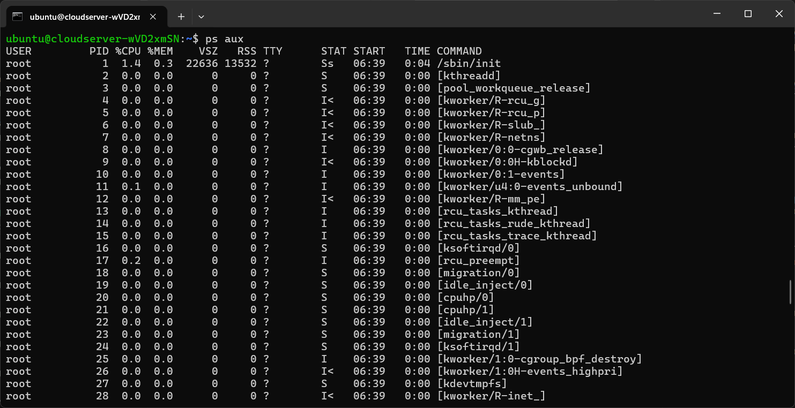
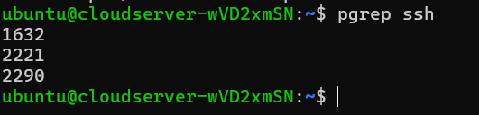
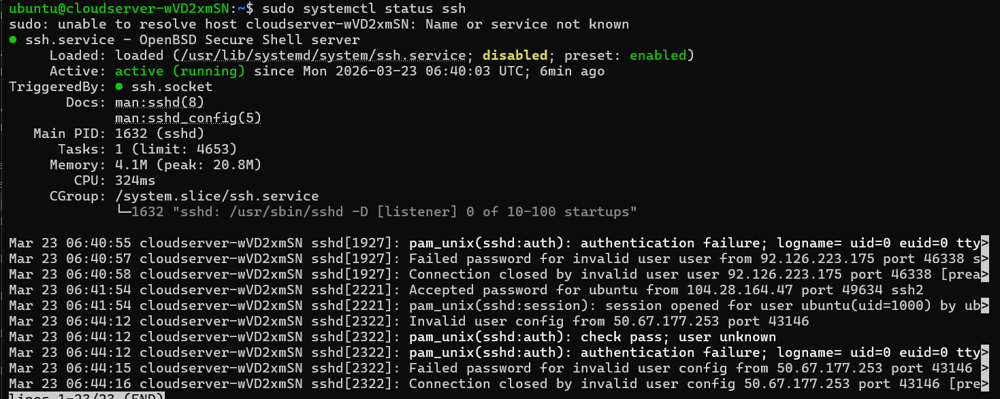
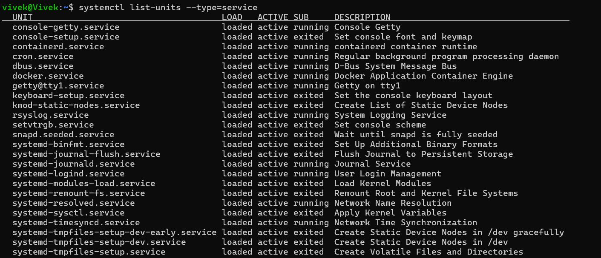
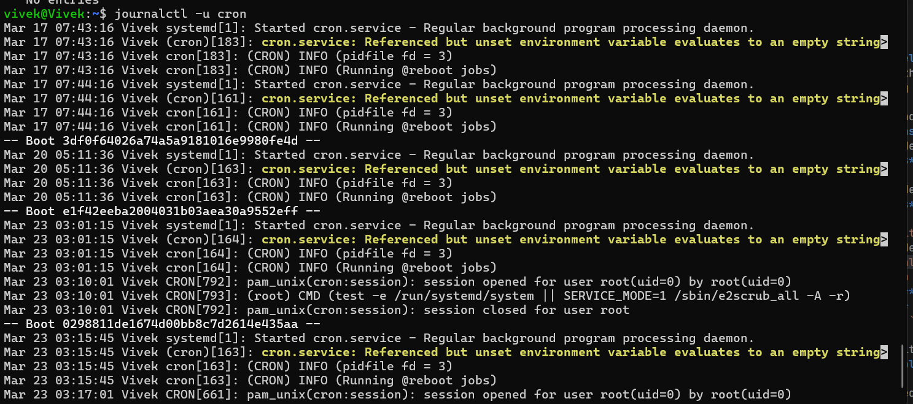
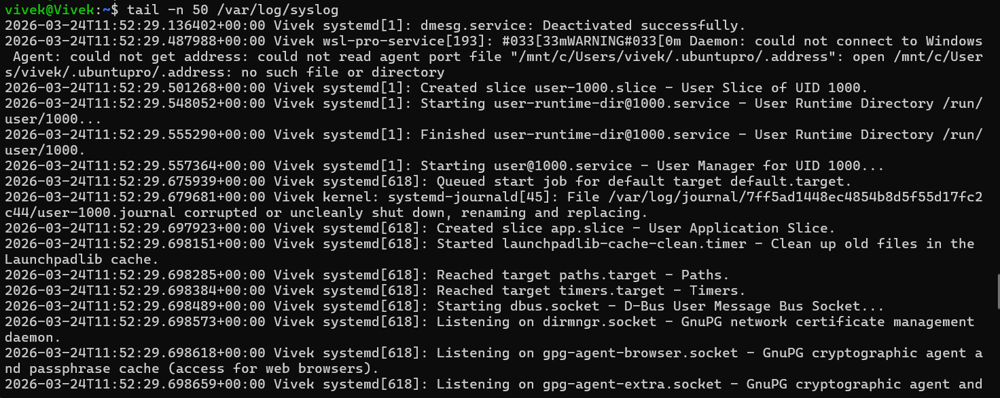

# Day-4 Linux Practice
## Overview
This is a hands on Pracice day to build muscle memory with Linux fundamentals.

Enviroment: Utho cloud Linux VM

## Process Commands 

### 1. `ps aux` - List all running processes with detailed information.

### 2.  `pgrep ssh` - Search for processes related to SSH.

all the processes run by ssh

## Service Commands
### 1. `systemctl status ssh` - Check the status of the SSH service.

### 2. `systemctl list-units --type=service` - List all active services.

## Log Commands
### 1. `journalctl -u cron` - View logs for the cron service.

### 2. `tail -n 50 /var/log/syslog` - View the last 50 lines of the system log.
