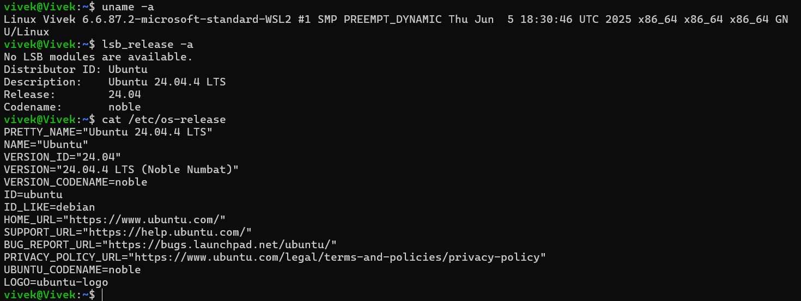
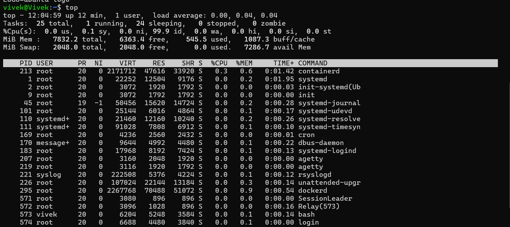
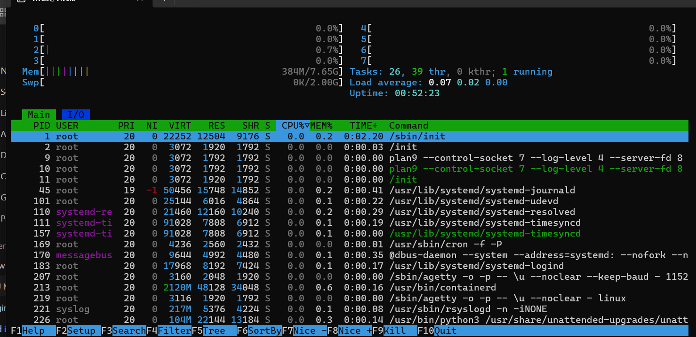
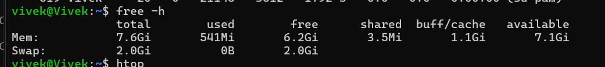
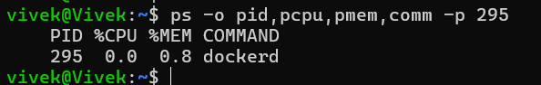
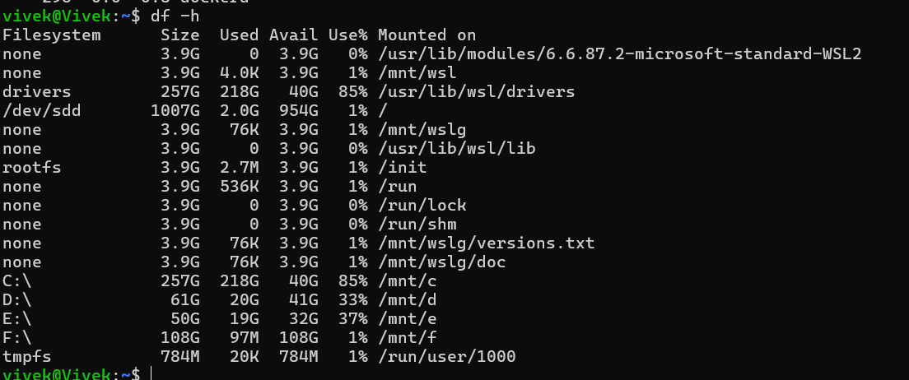
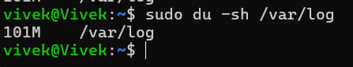
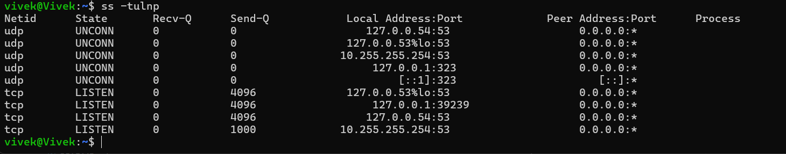
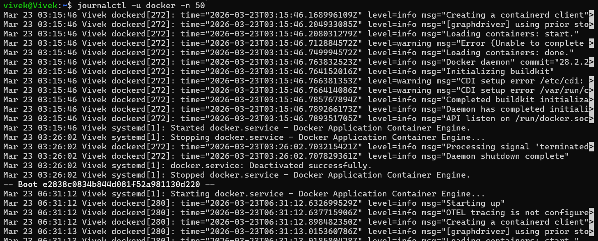
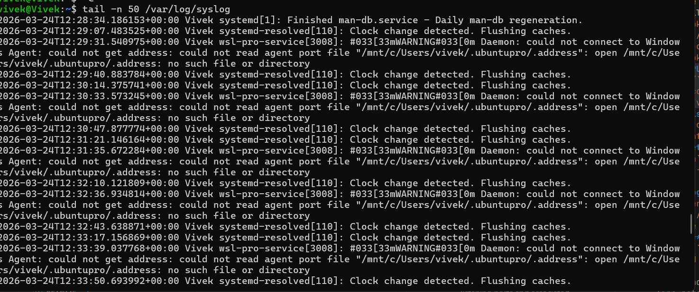

# Linux Troubleshooting Runbook

## Target Service / Process
`docker`

## Enviroment Basics
<!-- name of command - Explanation -->
- `uname -a` - to see the kernel version and architecture
- `cat /etc/os-release` - to check the Linux distribution and version
- `lsb_release -a` - alternative to check Linux distribution details

## Snapshot: CPU & Memory
- `top` - to monitor real-time CPU and memory usage of processes

- `htop` - an interactive process viewer for more detailed insights

- `free -h` - to check overall memory usage and availability

- `ps -o pid,pcpu,pmem,comm -p 295` - to check CPU and memory usage of the `docker` process

## Snapshot: Disk & IO
- `df -h` - to check disk space usage

- `du -sh /var/log` - to check the size of log files

## Network
- `ss -tulpn` - to check listening ports and associated processes

- `curl -I http://localhost:80` - to check if the web service is responding

## Logs Reviewed
- `journalctl -u docker -n 50` - to review the last 50 lines of Docker logs

- `tail -n 50 /var/log/syslog` - to check for any system-level errors

## Quick Findings
- Docker is running with moderate CPU and memory usage.
- Disk space is sufficient, but log files are growing rapidly.
- No critical errors found in the recent logs.
