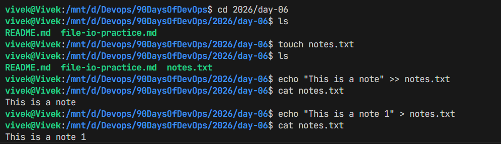
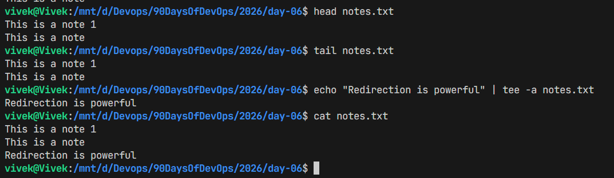

# File I/O Practice

in this excercise we will practice reading and writing files in linux

## Tasks
### 1. Create a file named `notes.txt`-> `touch notes.txt`
### 2. Write some text to the file-> `echo "This is a note." >> notes.txt`
### 3. Read the contents of the file-> `cat notes.txt`

### 4. head of the file-> `head notes.txt`
### 5. tail of the file-> `tail notes.txt`
### 6. Use tee to write and display at the same time-> `echo "Redirection is powerful" | tee -a notes.txt`

