# Part - 1 : Linux File System

## / (root) - The starting point of everything. It contains all the files and directories in the system.
- Example files/folders: `bin`, `etc`, `home`
- I would use this when I need to navigate to any directory in the system, as everything starts from here. 
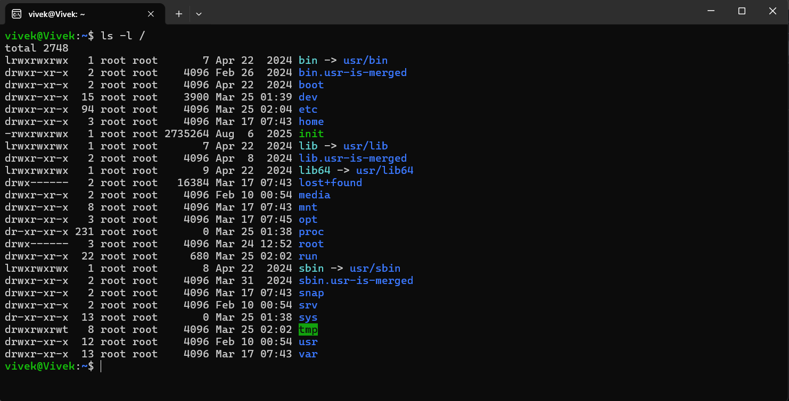

## /home - User home directories. Each user has a subdirectory here where they can store their personal files and settings.
- Folders: vivek
- I whould use this when i want to access my personal files

## /root - Root user's home directory
- Iwhould use this when i need to access root user's files


## /etc - Config files.
- Example files: `NetworkManager`, `cron.d`
- I would use this when I need to change system configurations
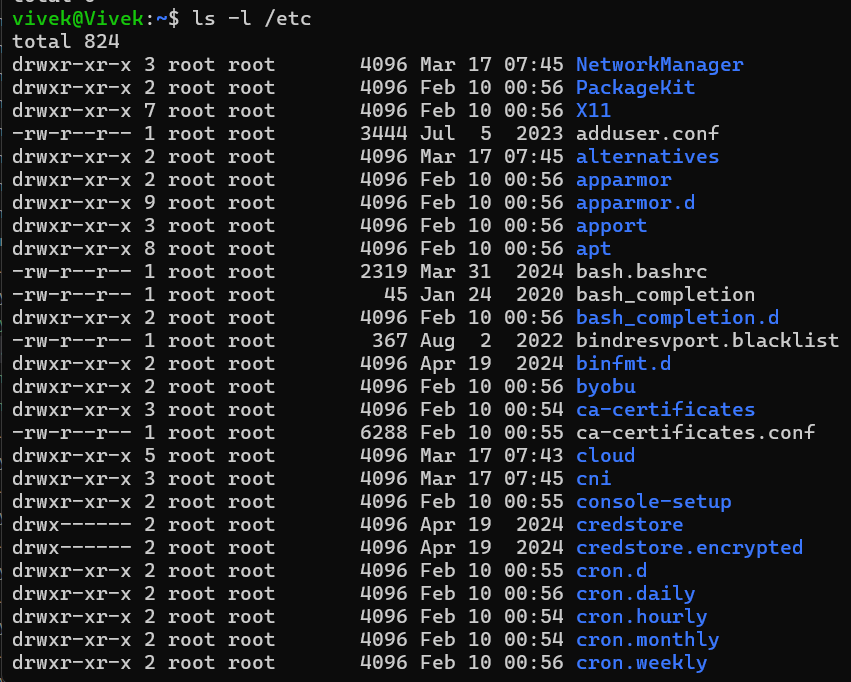

## /var/log - Log files
- Example files: `syslog`, `auth.log`
- I would use this when I need to check system logs for troubleshooting 
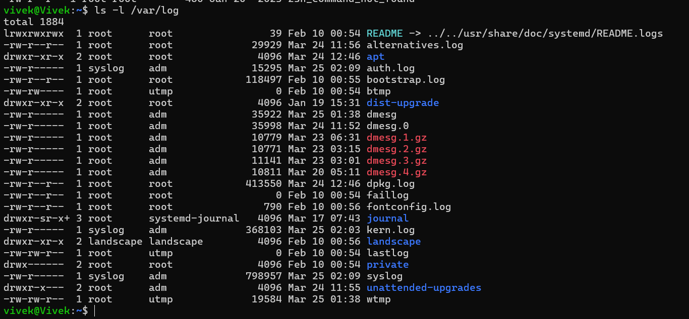

## /tmp - Temporary files
- I would use this when I need to store temporary files that do not need to be preserved after a reboot.


## /bin - Essential command binaries
- Example files: `ls`, `cat`
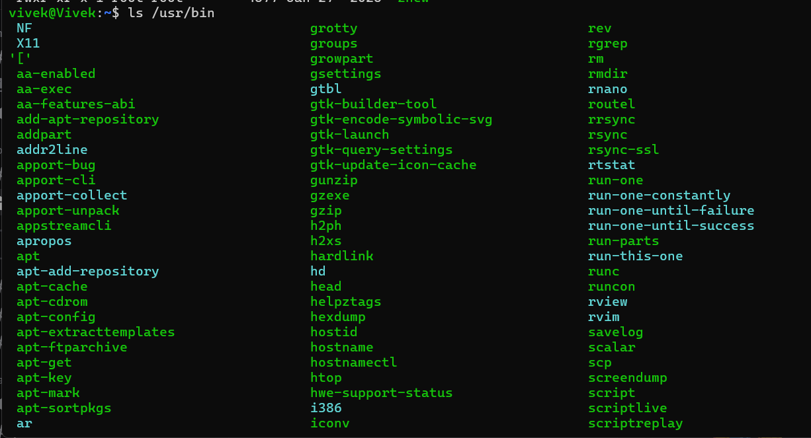

## /usr/bin - User command binaries
- Example files: `python3`, `gcc`

## /opt - Optional/third-party applications
- I would use this when I need to install third-party applications that are not part of the standard system packages.


# Linux File System Hierarchy summary table:
# Linux Filesystem Hierarchy (FHS)

Quick revision guide for Linux filesystem hierarchy, with **examples**, **key points**, and **memory tips** .

---

## Root Directory `/`
- **Description:** Top-level directory; all files start here.
- **Exam Tip:** Always start your path from `/`.
- **Example:** `/etc/passwd`

---

## Essential Commands

| Directory | Purpose | Example | Tip |
|-----------|---------|---------|----------|
| `/bin`   | Basic user commands | `/bin/ls`, `/bin/cp` | Commands needed to boot & run system |
| `/sbin`  | Admin/system commands | `/sbin/reboot`, `/sbin/fsck` | Only root/system admin uses these |

---

## Configuration Files

| Directory | Purpose | Example | Tip |
|-----------|---------|---------|----------|
| `/etc`   | System-wide configuration | `/etc/ssh/sshd_config` | Think: "E" for **Edit config** |
| `/root`  | Root user home | `/root/.bashrc` | Root’s personal files |

---

## User Data & Applications

| Directory | Purpose | Example | Tip |
|-----------|---------|---------|----------|
| `/home`  | User personal files | `/home/alex/document.txt` | Each user has their own folder |
| `/usr`   | User applications | `/usr/bin/python3` | Non-essential system programs |
| `/lib`   | Essential libraries | `/lib/libc.so.6` | Needed by binaries in `/bin` & `/sbin` |

---

## Logs, Temporary & Variable Data

| Directory | Purpose | Example | Tip |
|-----------|---------|---------|----------|
| `/var`   | Variable data/logs | `/var/log/syslog` | Think: "Var = Variable" |
| `/tmp`   | Temporary files | `/tmp/test.tmp` | Files cleared on reboot |

---

## Boot & Devices

| Directory | Purpose | Example | Tip |
|-----------|---------|---------|----------|
| `/boot`  | Bootloader/kernel | `/boot/vmlinuz` | Kernel files live here |
| `/dev`   | Device files | `/dev/sda` | Devices are files |
| `/proc`  | Process info (virtual) | `/proc/cpuinfo` | Think: "Proc = Process" |
| `/sys`   | Kernel & hardware info | `/sys/class/net` | System info interface |

---

## Mount Points

| Directory | Purpose | Example | Tip |
|-----------|---------|---------|----------|
| `/mnt`   | Temporary mounts | `/mnt/backup` | Manual mounts go here |
| `/media` | Removable media | `/media/usb` | USB/CD drives appear here |

---

# Scenario-Based Practice: Troubleshooting Flow

## Scenario 1 : Service Not Starting
A web application service called 'myapp' failed to start after a server reboot.
What commands would you run to diagnose the issue?
Write at least 4 commands in order.

- `systemctl status docker`
Why? : To check the current status of the service and see if there are any error messages.
- `systemctl is-enabled docker`
Why? : To check if the service is enabled to start on boot.

- `journalctl -u docker`
Why? : To view the logs related to the service and identify any errors.
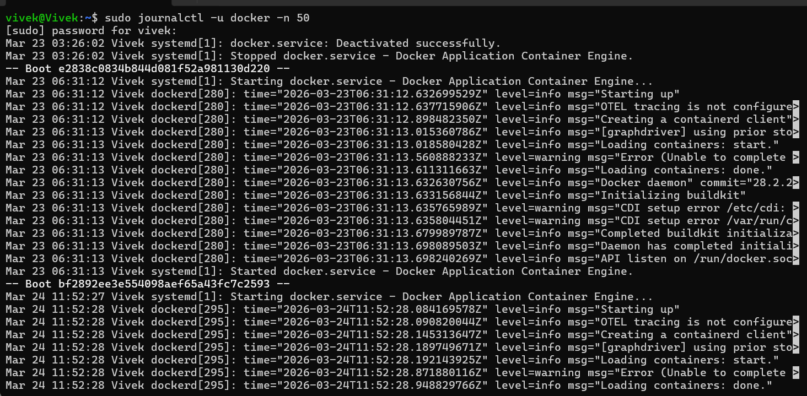

## **Scenario 2: High CPU Usage** 
```
Your manager reports that the application server is slow.
You SSH into the server. What commands would you run to identify
which process is using high CPU?
```
- `top`
Why? : To see a live view of CPU usage and identify which processes are consuming the most CPU resources.
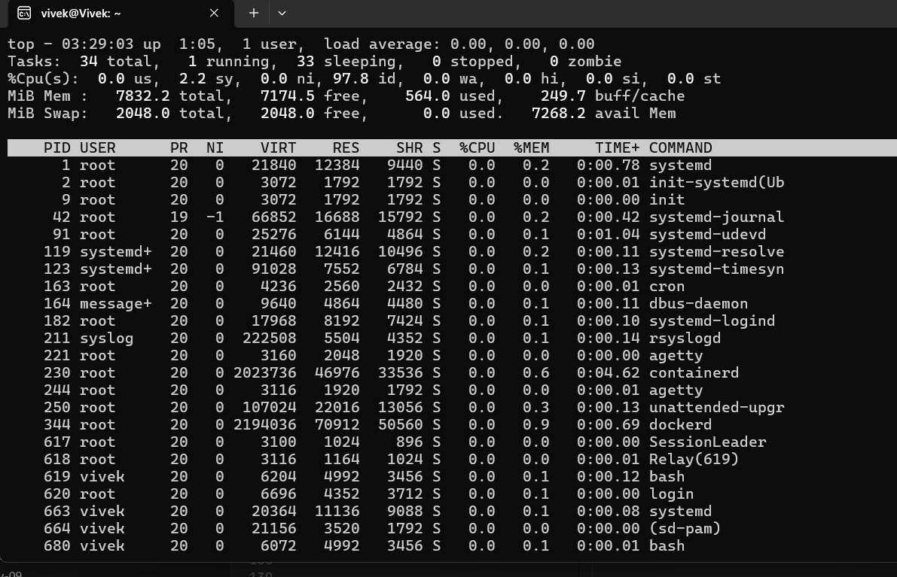

- `htop`
Why? : An enhanced version of top with a more user-friendly interface, allowing for easier identification of high CPU processes.
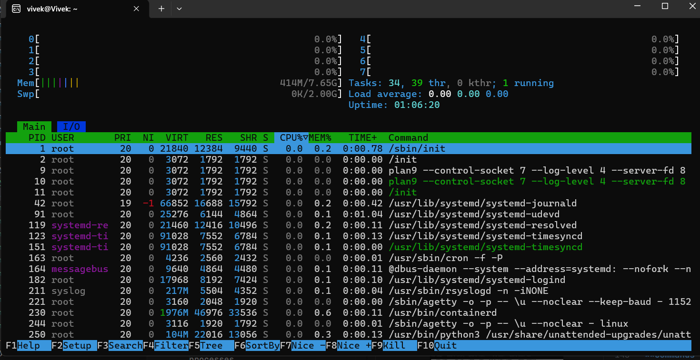

- `ps aux --sort=-%cpu | head -10`
Why? : To get a snapshot of the top 10 processes sorted by CPU usage, which can help identify the culprit quickly.
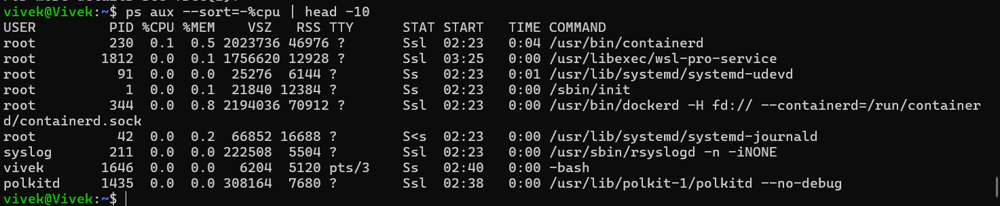


## **Scenario 3: Finding Service Logs** 
```
A developer asks: "Where are the logs for the 'docker' service?"
The service is managed by systemd.
What commands would you use?
```

- `journalctl -u docker`
Why? : This command will show the logs for the 'docker' service
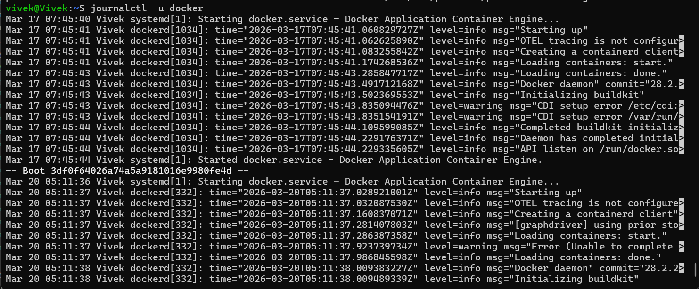
- `journalctl -u docker -f`
Why? : This command will follow the logs for the 'docker' service in real-time
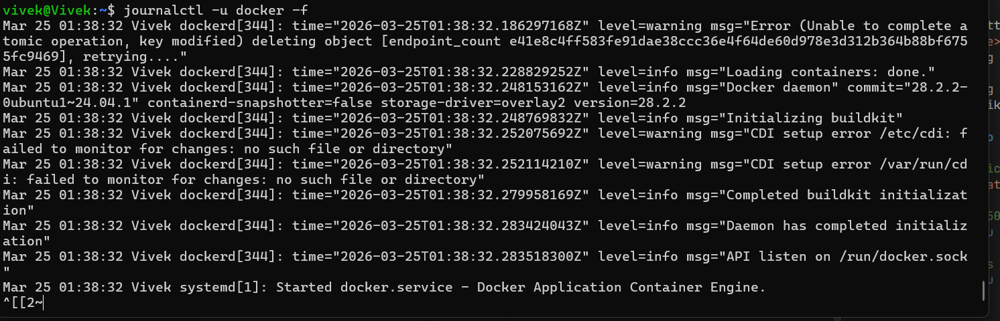
- `journalctl -u docker -n 50`
Why? : This command will show the last 50 lines of logs for the 'docker' service
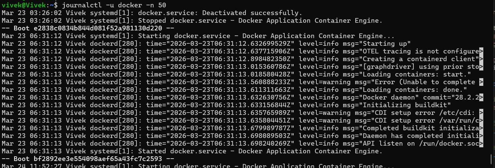


## **Scenario 4: File Permissions Issue** 
```
A script at /home/user/backup.sh is not executing.
When you run it: ./backup.sh
You get: "Permission denied"

What commands would you use to fix this?
```
- `ls -l /home/user/backup.sh`
Why? : To check the current permissions of the script and see if it has execute permissions.

- `chmod +x /home/user/backup.sh`
Why? : To add execute permissions to the script, allowing it to be run.

- `./backup.sh`
Why? : To run the script after fixing the permissions issue.


