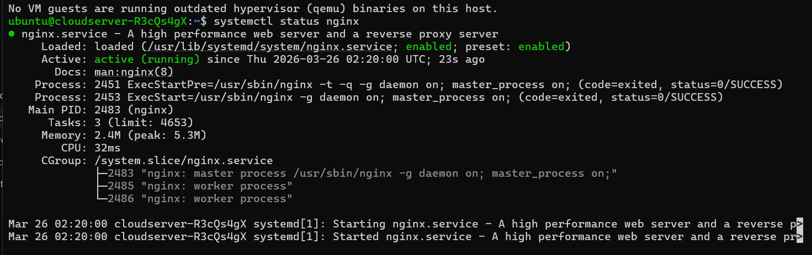
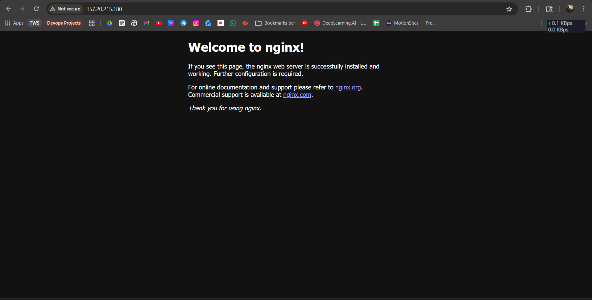
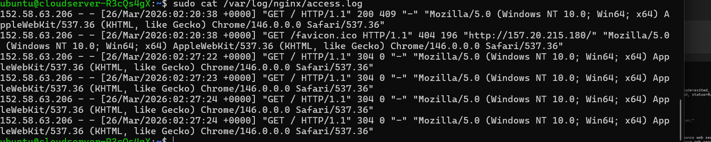
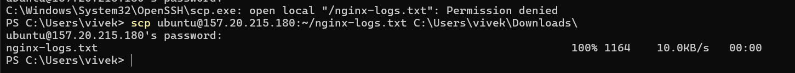
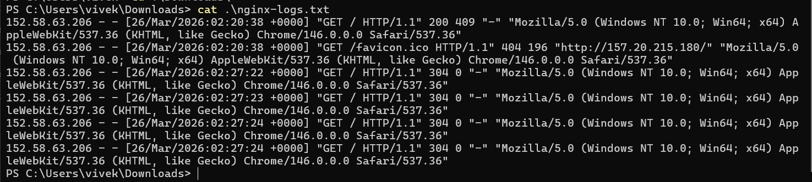

# Cloud Deployment

## Part 1: Launch Cloud Instance & SSH Access
### Step 1: Create a Cloud Instance
- Choose a cloud provider ->Utho
- Create a new instance with the following specifications:
  - OS: Ubuntu 24.04 LTS
  - Security Group: Allow inbound traffic on port 22 (SSH) and port 80 (HTTP)

### Step 2: Connect via SSH
- Obtain the public IP address of your instance
- Use the following command to connect via SSH:
```bash
ssh root@<your-instance-ip>
```
## Part 2: Install Docker & Nginx
### Step 1: Update System
```bash
sudo apt update && sudo apt upgrade -y
``` 
### Step 2: Install Nginx
```bash
sudo apt install nginx -y
```
### Verify Nginx is running:
```bash
sudo systemctl status nginx
``` 


## Part 3: Security Group Configuration
### Test Web Access:
Open browser and visit: `http://<your-instance-ip>`


## Part 4: Extract Nginx Logs
### Step 1: View Nginx Logs
```bash
sudo cat /var/log/nginx/access.log
```


### Step 2: Save Logs to File
```bash
sudo cat /var/log/nginx/access.log > ~/nginx-logs.txt
```

### Step 3: Download Log File to Your Local Machine
```bash
# On your local machine (new terminal window)
# For Utho:
scp ubuntu@157.20.215.180:~/nginx-logs.txt C:\Users\vivek\Downloads\
```


### Step 4: View Downloaded Logs

```bash
cat ~/Downloads/nginx-logs.txt
```
