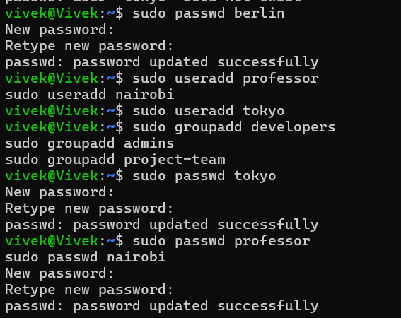
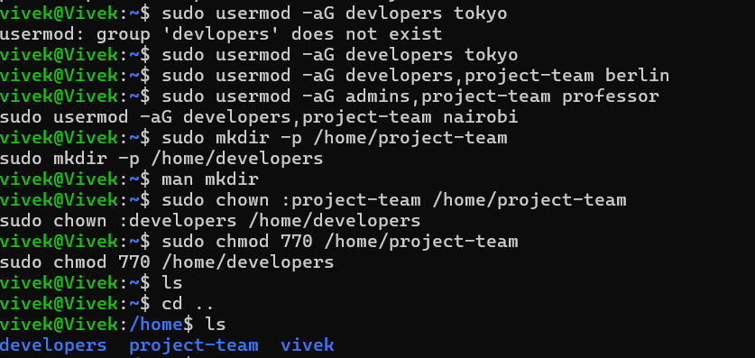
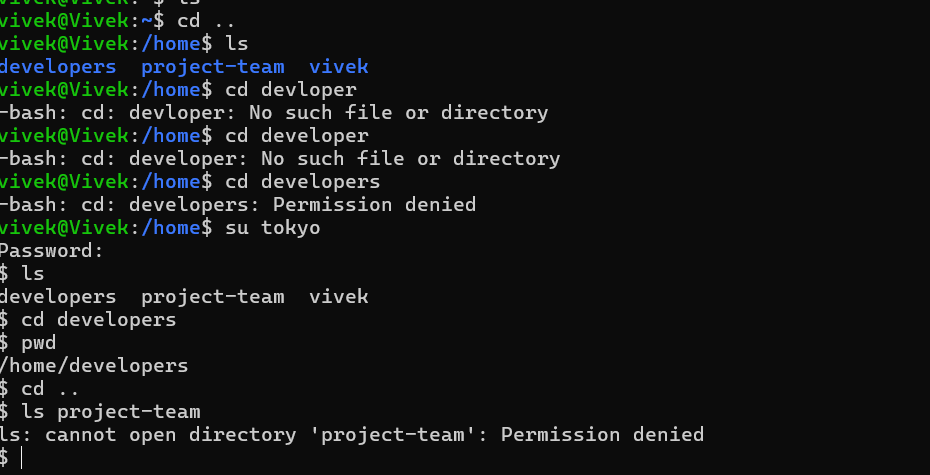

# User Management
## Users & Groups Created
- Users: tokyo, berlin, professor, nairobi
- Groups: developers, admins, project-team

## Group Assignments
- tokyo -> developers
- berlin -> developers, project-team
- professor -> admins, project-team
- nairobi -> developers, project-team

## Directories Created
- /home/project-team
- /home/developers

## Commands Used
```bash
# Create groups
sudo groupadd developers
sudo groupadd admins
sudo groupadd project-team
# Create users and assign to password
sudo useradd tokyo
sudo useradd berlin
sudo useradd professor
sudo useradd nairobi

# Set passwords for users
sudo passwd tokyo
sudo passwd berlin
sudo passwd professor
sudo passwd nairobi

# assign groups
sudo usermod -aG developers tokyo
sudo usermod -aG developers,project-team berlin
sudo usermod -aG admins,project-team professor
sudo usermod -aG developers,project-team nairobi

# Create directories
sudo mkdir -p /home/project-team
sudo mkdir -p /home/developers
# Set permissions
sudo chown :project-team /home/project-team
sudo chown :developers /home/developers
sudo chmod 770 /home/project-team
sudo chmod 770 /home/developers
```



## What I Learned
- How to create users and groups in Linux
- How to assign users to multiple groups
- How to set permissions for directories based on group ownership
- The importance of user management for security and organization in a Linux environment
