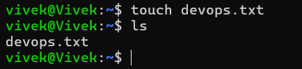
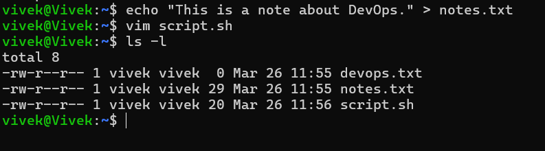
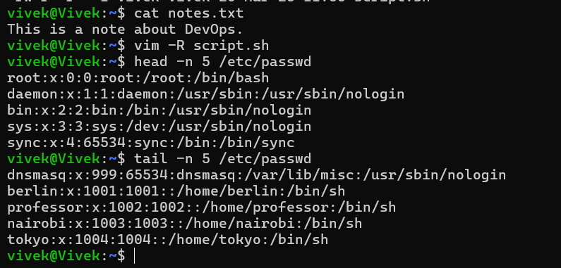
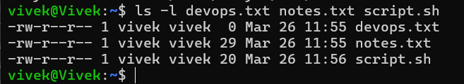
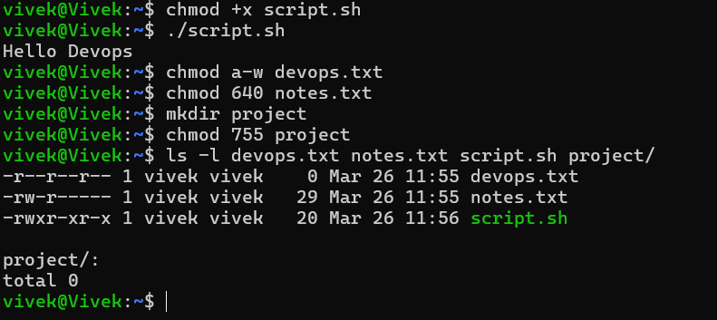
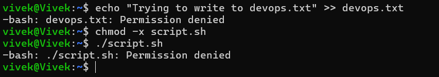

# File Permissions Challenge

## Task 1: Create files and check permissions

### 1. Create empty file `devops.txt` using `touch`
```bash
touch devops.txt
``` 


### 2. Create `notes.txt` with some content using `echo`
```bash
echo "This is a note about DevOps." > notes.txt
```

### 3. Create `script.sh` using `vim` with content: `echo "Hello DevOps"`
```bash
vim script.sh
```


## Task 2: Read files

### 1. Read `notes.txt` using `cat`
```bash
cat notes.txt
```
### 2. View `script.sh` in vim read-only mode
```bash
vim -R script.sh
```
### 3. Display first 5 lines of `/etc/passwd` using `head`
```bash
head -n 5 /etc/passwd
```
### 4. Display last 5 lines of `/etc/passwd` using `tail`
```bash
tail -n 5 /etc/passwd
```
 

## Task 3: Understand permissions
### Check your files: `ls -l devops.txt notes.txt script.sh`
```bash
ls -l devops.txt notes.txt script.sh
```
### Answer: What are current permissions? Who can read/write/execute?
- `devops.txt`: `-rw-r--r--` (owner can read/write, group and others can read)
- `notes.txt`: `-rw-r--r--` (owner can read/write,
group and others can read)
- `script.sh`: `-rw-r--r--` (owner can read/write,
group and others can read)


## Task 4: Modify permissions

### 1. Make `script.sh` executable → run it with `./script.sh`
```bash
chmod +x script.sh
./script.sh
```
### 2. Set `devops.txt` to read-only (remove write for all)
```bash
chmod a-w devops.txt
```
### 3. Set `notes.txt` to `640` (owner: rw, group: r, others: none)
```bash
chmod 640 notes.txt
```
### 4. Create directory `project/` with permissions `755`
```bash
mkdir project
chmod 755 project
```
### Verify: `ls -l` after each change
```bash
ls -l devops.txt notes.txt script.sh project/
```


## Task 5: Test permissions
### 1. Try writing to a read-only file - what happens?
```bash
echo "Trying to write to devops.txt" >> devops.txt
```
### 2. Try executing a file without execute permission
```bash
chmod -x script.sh
./script.sh
```

### 3. Document the error messages
- Writing to `devops.txt` results in: `bash: devops.txt: Permission
denied`
- Executing `script.sh` without execute permission results in: `bash: ./script.sh: Permission denied`


