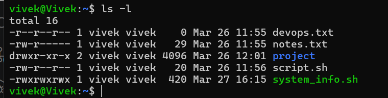
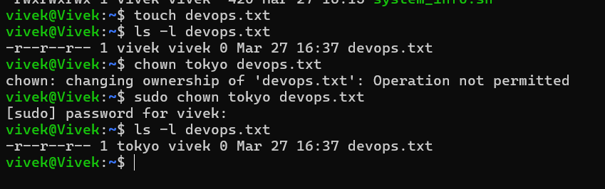
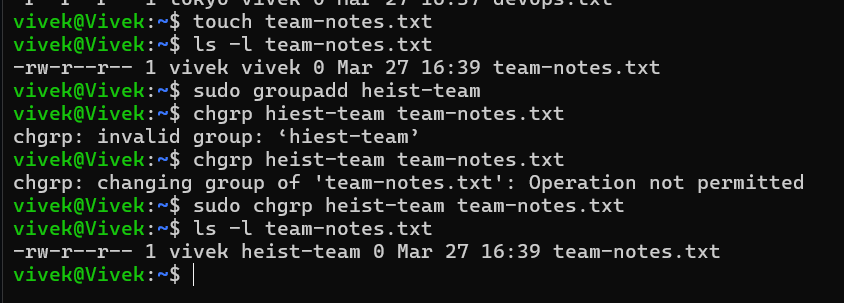
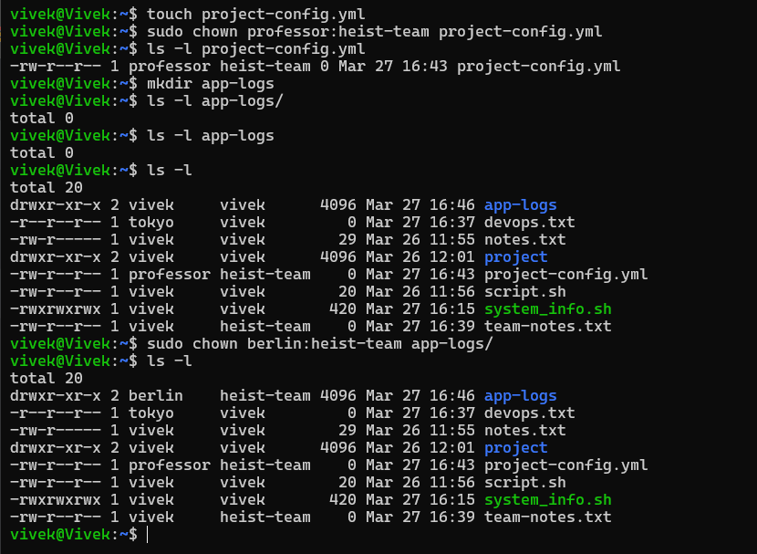
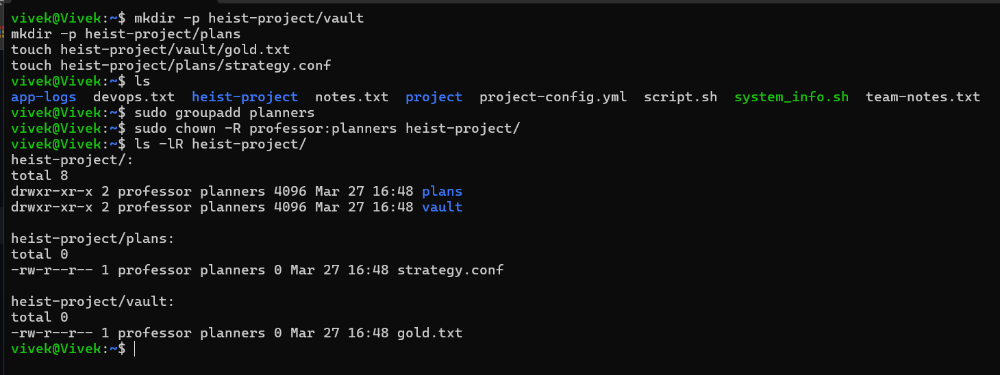
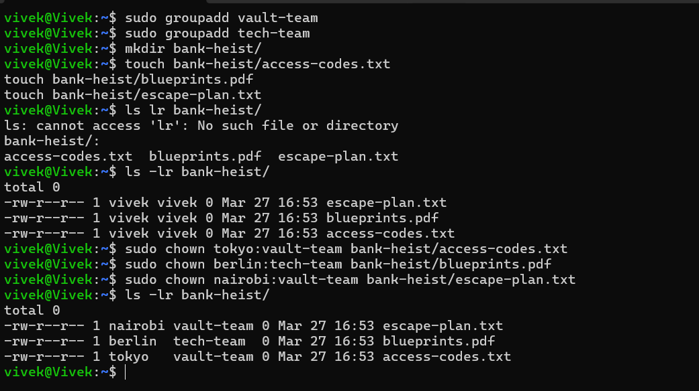

# File Ownership in Linux

## Task 1: Undwestanding Ownership

**rwxrwxrwx**

types 
- owner -> First three chars
- group -> Second three chars
- others -> Last three chars

### difference between owner and group
- Owner: owns the file
- Group collection of users who has access to the file


---
## Task 2: Basic chown Operations

1. Create file `devops-file.txt`
2. Check current owner: `ls -l devops-file.txt`
3. Change owner to `tokyo` (create user if needed)
4. Change owner to `berlin`
5. Verify the changes

**Try:**
```bash
sudo chown tokyo devops-file.txt
```



---

## Task 3: Basic chgrp Operations (15 minutes)

1. Create file `team-notes.txt`
2. Check current group: `ls -l team-notes.txt`
3. Create group: `sudo groupadd heist-team`
4. Change file group to `heist-team`
5. Verify the change


---

## Task 4: Combined Owner & Group Change (15 minutes)

Using `chown` you can change both owner and group together:

1. Create file `project-config.yaml`
2. Change owner to `professor` AND group to `heist-team` (one command)
3. Create directory `app-logs/`
4. Change its owner to `berlin` and group to `heist-team`

**Syntax:** `sudo chown owner:group filename`


---

## Task 5: Recursive Ownership Change (15 minutes)



## Task 6: Verify Ownership Changes (10 minutes)

