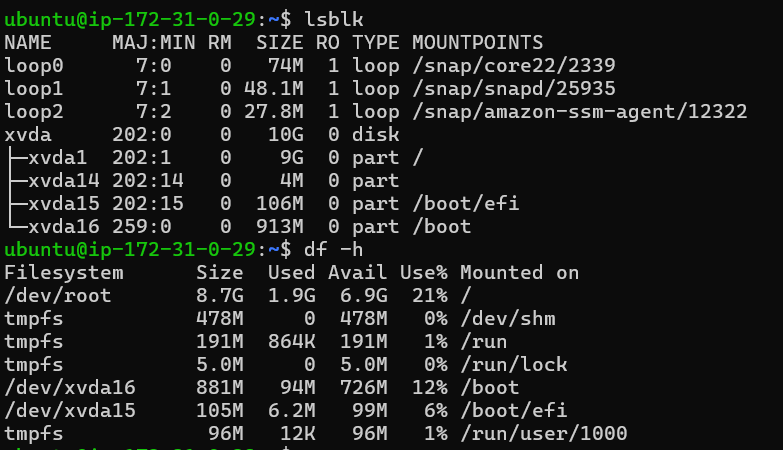
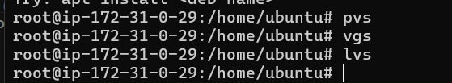
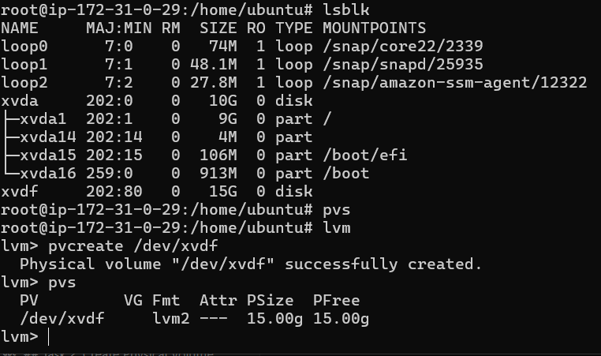
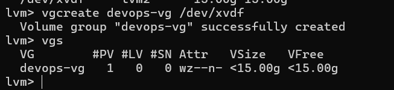
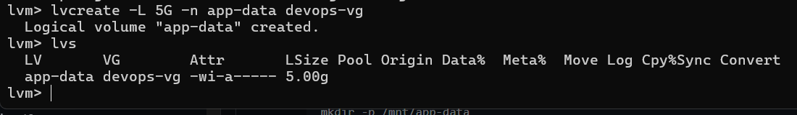
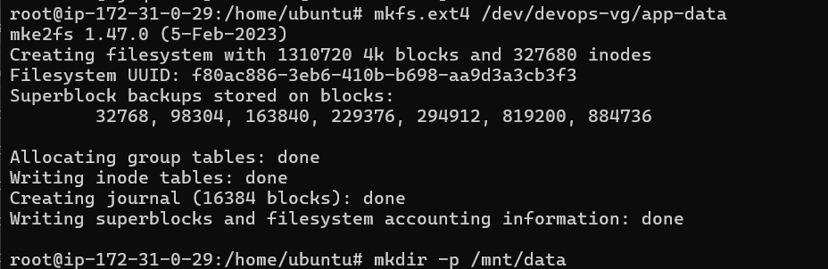
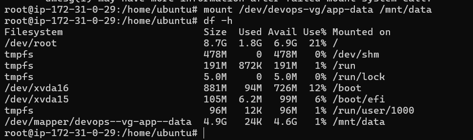
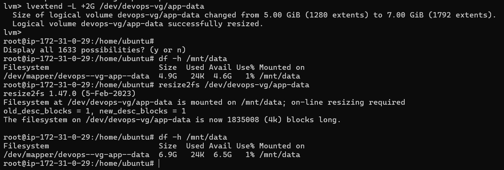

# LVM - Logical Volume Manager

## Task 1: Check Current Storage

Run the following commands to check your current storage setup:

```bash
lsblk
pvs
vgs
lvs
df -h
```



## Task 2: Create Physical Volume

I  am Working on EC 2  so i have Created an EBS volume and attached it to my instance. Now I will create a physical volume on the new disk.

```bash
pvcreate /dev/xvdf  
pvs
```


## Task 3: Create Volume Group
Now, I will create a volume group named `devops-vg` using the physical volume we just created.

```bash
vgcreate devops-vg /dev/xvdf
vgs
```


## Task 4: Create Logical Volume
Next, I will create a logical volume named `app-data` with a size of 500MB within the `devops-vg` volume group.

```bash
lvcreate -L 5G -n app-data devops-vg
lvs
```


## Task 5: Format and Mount
Now, I will format the logical volume with the ext4 filesystem and mount it to `/mnt/data`.

```bash
mkfs.ext4 /dev/devops-vg/app-data
mkdir -p /mnt/data
mount /dev/devops-vg/app-data /mnt/data
df -h 
```



## Task 6: Extend the Volume
Finally, I will extend the logical volume by an additional 200MB and resize the filesystem to use the new space.

```bash 
lvextend -L +2G /dev/devops-vg/app-data
resize2fs /dev/devops-vg/app-data
df -h /mnt/data
```



## What I Learned
- LVM allows for flexible disk management, enabling the creation of logical volumes that can be easily resized and managed.
- The process of creating a physical volume, volume group, and logical volume is straightforward and can be done using simple commands.
- Extending a logical volume and resizing the filesystem can be done without downtime, making it ideal for production environments.