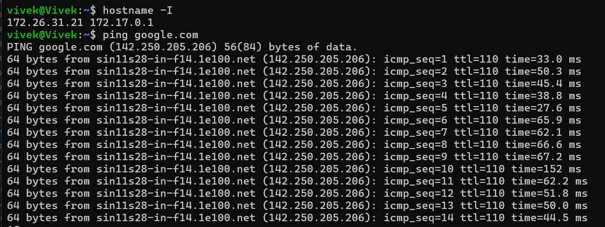
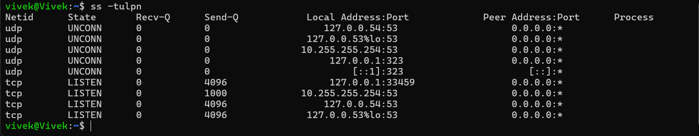
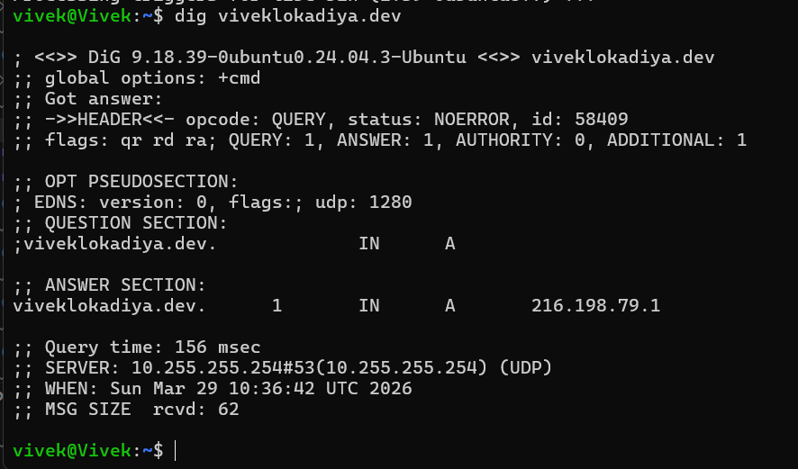
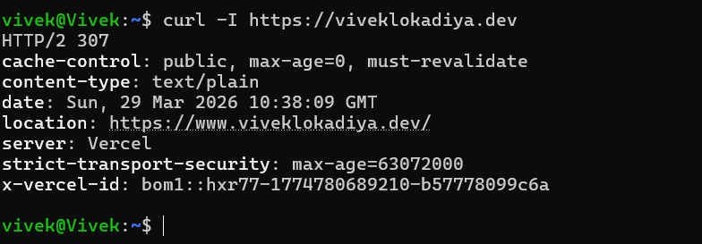
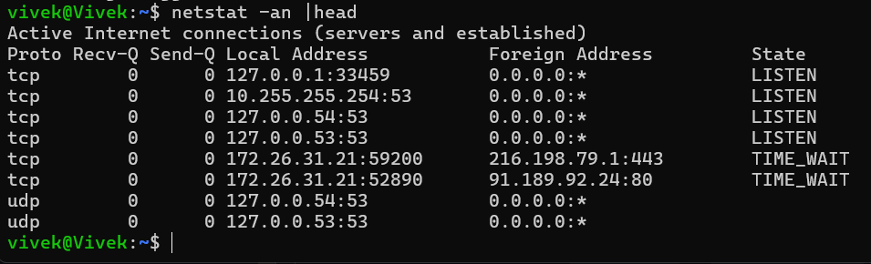
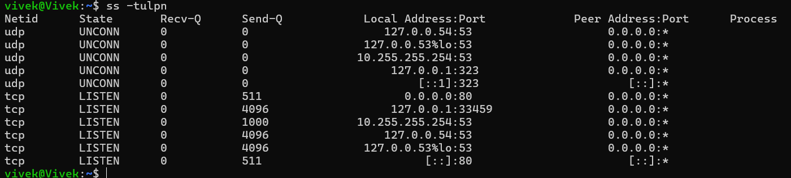
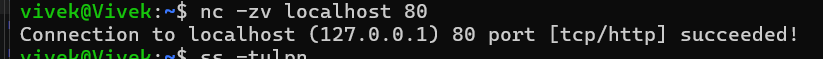

# Networking Fundamentals & Hands-on Checks

## OSI vs TCP/IP Models

### OSI Model
- Application - HTTP, HTTPS, DNS
- Presentation - Data formatting, encryption
- Session- Establishes, manages, and terminates connections
- Transport- TCP, UDP
- Network- IP
- Data Link - Ethernet, Wi-Fi
- Physical- Cables, switches, wireless signals

### TCP/IP Stack
- Application - HTTP, HTTPS, DNS
- Transport - TCP, UDP
- Internet  - IP
- Link - Ethernet, Wi-Fi


## Hands-on Checklist

### Identity
```bash
hostname -I
```
### Reachability
```bash
ping google.com
```


### Path
```bash
traceroute google.com
```

### Ports
```bash
ss -tulpn
```

### Name resolution
```bash
dig viveklokadiya.dev
```


### HTTP check
```bash
curl -I https://viveklokadiya.dev
```

### Connections snapshot
```bash
netstat -an | head
```


## Mini Task: Port Probe & Interpret

1) Identify one listening port from `ss -tulpn` (e.g., SSH on 22 or a local web app).


2) From the same machine, test it: `nc -zv localhost 80` 
```bash
nc -zv localhost 80
```

3) Is it reachable? Yes, port 80 is open and accepting connections.


