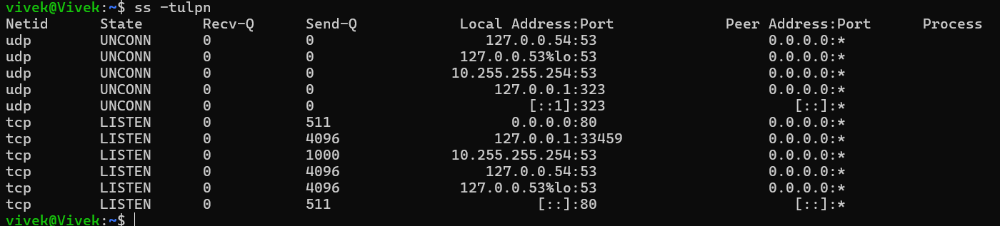

# Networking Concepts

## Task 1: DNS – How Names Become IPs

When you type `google.com` in yoour Browser and hit Enter then the following happens:
1. Browser finds ip of that domain in cache if not then it sends query to DNS resolver
2. DNS resolver returns the IP address of google.com to the browser
3. Browser then establishes a connection to that IP address and sends an HTTP request

Record types:
 - `A` : Maps IPv4 address to a domain name
- `AAAA` : Maps IPv6 address to a domain name
- `CNAME` :alias for another domain
- `MX` : Mail exchange record, specifies mail server for a domain
- `NS` : Name server record

## Task 2: IP Addressing

1. ip address is 32-bit number used to identify devices in network 
2. Public IPs are you can access with internet but Private IP is Works only in localhost
3. Private IP ranges:
    - 10.0.0.0 to 10.255.255.255
    - 172.16.0.0 to 172.31.255.255
    - 192.168.0.0 to 192.168.255.255

## Task 3: CIDR & Subnetting

1. What does `/24` mean in `192.168.1.0/24`?
 - it means there are 24 bits for network and 8 bits for host
2. How many usable hosts in a `/24`? A `/16`? A `/28`?
- /24 has 254 usable hosts
- /16 has 65534 usable hosts
- /28 has 14 usable hosts

3. Why do we subnet?
 - to devide a large network in smaller networks 

| CIDR | Subnet Mask | Total IPs | Usable Hosts |
|------|-------------|-----------|--------------|
| /24  | 255.255.255.0 | 256 | 254 |
| /16  | 255.255.0.0 | 65,536 | 65,534 |
| /28  | 255.255.255.240 | 16 | 14 |

## Task 4: Ports – The Doors to Services
1. What is a port? Why do we need them?
2. Document these common ports:

| Port | Service |
|------|---------|
| 22   | SSH       |
| 80   | HTTP     |
| 443  | HTTPS    |
| 53   | DNS      |
| 3306 | MYSQL     |
| 6379 | redis   |
| 27017| mongodb |

3. Run `ss -tulpn` — match at least 2 listening ports to their services
```bash
ss -tulpn
```


80 - http
22 - ssh


## Task 5: Putting It Together

- You run curl http://myapp.com:8080 — what networking concepts from today are involved?
    - DNS resolution to get the IP address of myapp.com
    - Establishing a TCP connection to the IP address on port 8080
    - Sending an HTTP request to the server and receiving a response

- Your app can't reach a database at 192.168.1.100:3306 — what networking concepts from today are involved?
    - Check if the database server is running and listening on port 3306
    - Verify that the IP address
    - Check if there are any firewall rules blocking the connection
    - Ensure that the app and database are on the same network or have proper routing between them

