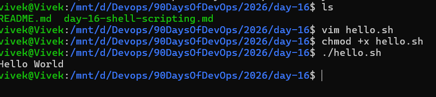
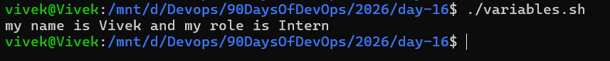
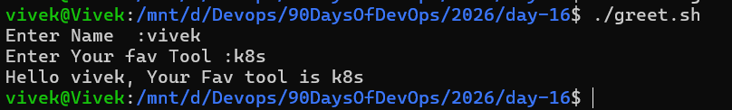
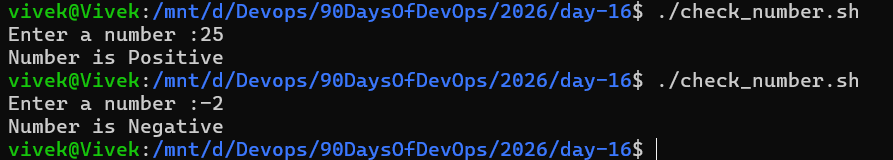
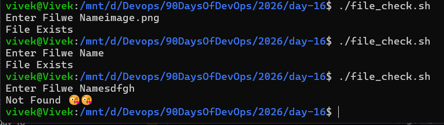
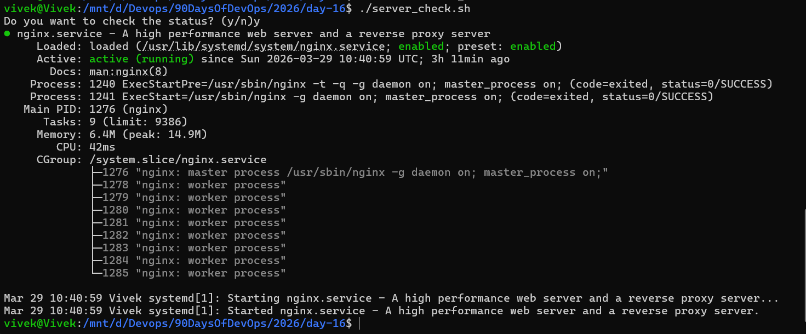

# Shell Scripting Basics

## Task 1: Your First Script

```bash
#!/bin/bash
echo "Hello, DevOps!"
```

**What happens if you remove the shebang line?**
- Without the Shabang line system won't know which interpreter to use to execute the script

## Task 2: Variables

```bash
#!/bin/bash

NAME="Vivek"
ROLE="Intern"

echo "my name is $NAME and my role is $ROLE"

```


- diff between single and double quotes in bash scripting
    - Double quotes allow for variable expansion, while single quotes treat everything as a literal string.

## Task 3 : User Input With Read Command

```bash
#!/bin/bash

read -p "Enter Name  :" NAME
read -p "Enter Your fav Tool :" TOOL

echo "Hello $NAME, Your Fav tool is $TOOL"
```



## Task 4: If-Else Conditions

1. 
```bash
#!/bin/bash

read -p "Enter a number :" NUMBER

if [ $NUMBER -gt 0 ]; then
	echo "Number is Positive";
elif [ $NUMBER -lt 0 ]; then
	echo "Number is Negative";
else 
	echo "Number is Zero";
fi
```


2. 
```bash
#!/bin/bash
#

read -p "Enter Filwe Name" FILE

if [ -f $FILE ]; then
	echo "File Exists"
else
	echo "Not Found 😘😘"
fi
```


## Task 5 : Combine All

```bash
#!/bin/bash
#

service="nginx"

read -p "Do you want to check the status? (y/n)" status

if [ $status==y ]; then
	systemctl status nginx
else
	echo "Skipped"
fi
```


