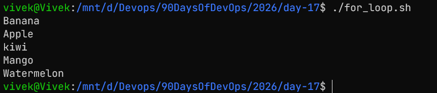
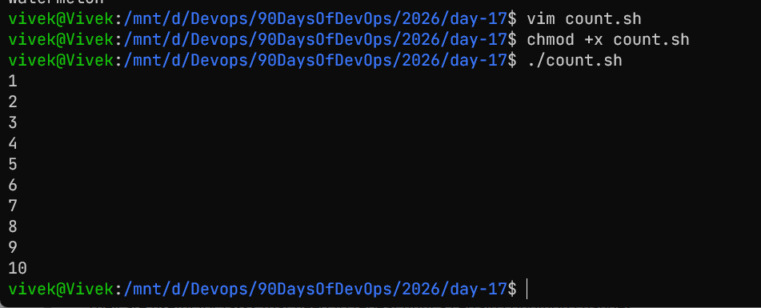
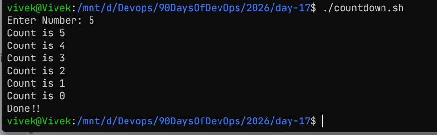
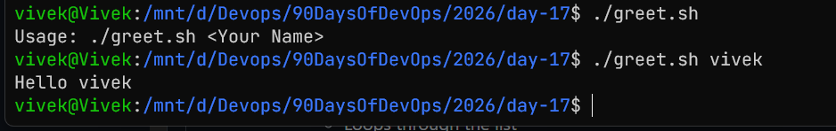
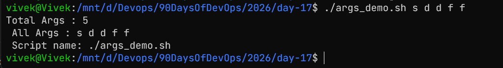
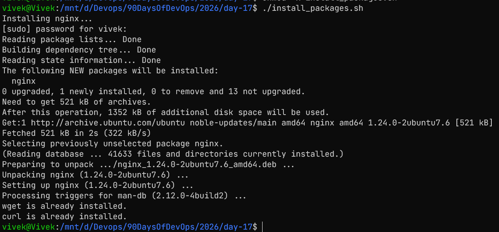
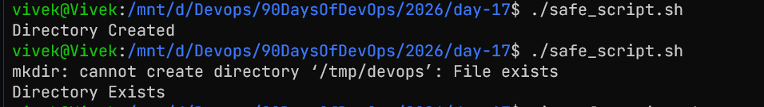

# Shell Scripting: Loops, Arguments & Error Handling

## Task 1: For Loop
1. `for_loop.sh`
```bash
#!/bin/bash

fruits=("Banana" "Apple" "kiwi" "Mango" "Watermelon")

for fruit in "${fruits[@]}"; do
	echo "$fruit"
done
```


2. `count.sh`
```bash
#!/bin/bash
#

for i in {1..10}; do
	echo "$i"
done
```


## Task 2: While Loop
```bash
#!/bin/bash

read -p "Enter Number: " num

while [ $num -ge 0 ]; do
	echo "Count is $num"
	((num--))
done

echo "Done!!"
```


## Task 3: Read User Input
1. 
```bash
#!/bin/bash


if [ "$#" -gt 0 ]; then
	echo "Hello $1"
else
	echo "Usage: ./greet.sh <Your Name>"
fi
```


2. 
```bash
#!/bin/bash

echo "Total Args : $#"
echo " All Args : $@"
echo " Script name: $0"
```


## Task 4: Install Packages
```bash
#!/bin/bash

packages=("nginx" "wget" "curl")

for package in "${packages[@]}"; do
    if dpkg -s "$package" &> /dev/null; then
        echo "$package is already installed."
    else
        echo "Installing $package..."
        sudo apt-get install -y "$package"
    fi
done
```


## Task 5: Error Handling
```bash
#!/bin/bash
set -e
mkdir /tmp/devops && echo "Directory Created" || echo "Directory Exists"
```


