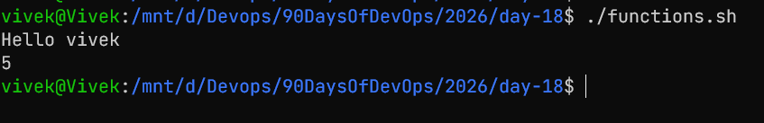
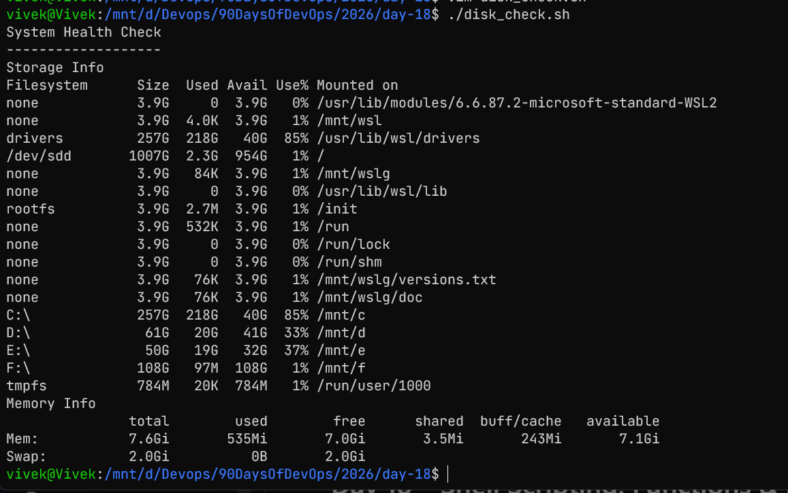
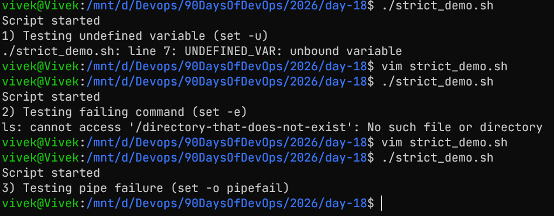
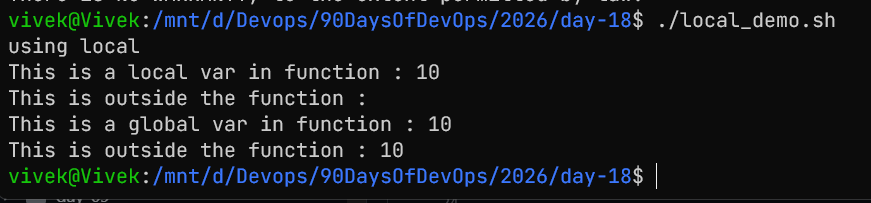
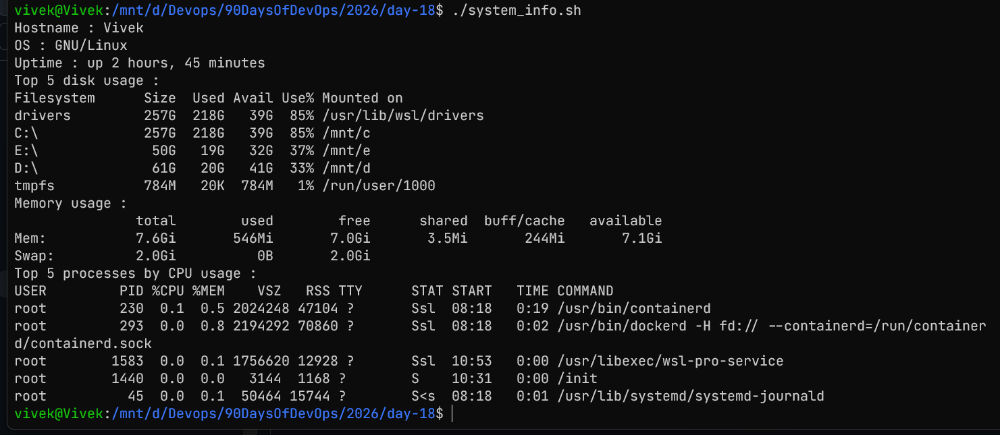

# functions in bash

## Task 1: Basic Functions

```Bash
#!/bin/bash


greet(){
	local name=$1
	echo "Hello $name"	
}

add(){
	local sum=$(($1 + $2))
	echo "$sum"
}

greet "vivek"
add 2 3
```


## Task 2: Functions with Return Values

```Bash
#!/bin/bash

check_disk(){
	echo "Storage Info"
	df -h
}

check_memory(){
	echo "Memory Info"
	free -h
}

main() {
    echo "System Health Check"
    echo "-------------------"
    
    check_disk
    check_memory
}

main
```


## Task 3: Strict mode and error handling

```Bash
#!/bin/bash
set -euo pipefail

echo "Script started"

echo "1) Testing undefined variable (set -u)"
echo "Value: $UNDEFINED_VAR"

echo "2) Testing failing command (set -e)"
ls /directory-that-does-not-exist

echo "3) Testing pipe failure (set -o pipefail)"
echo "hello" | grep "world"

echo "Script completed"
```


## Task 4: Local Variables
```Bash
#!/bin/bash

echo "using local"

my_local(){
    local x=10
    echo "This is a local var in function : $x"
}

my_local
echo "This is outside the function : $x"

global(){
    y=10
    echo "This is a global var in function : $y"
}

global
echo "This is outside the function : $y"
```


## task 5 : system information script

```Bash
#!/bin/bash
set -euo pipefail

printhostandos(){
    echo "Hostname : $(hostname)"
    echo "OS : $(uname -o)"
}

printuptime(){
    echo "Uptime : $(uptime -p)"
}

printdiskusagetop5(){
    echo "Top 5 disk usage :"
    df -h | sort -k 5 -r | head -n 6
}

printmemoryusage(){
    echo "Memory usage :"
    free -h
}
printtop5processes(){
    echo "Top 5 processes by CPU usage :"
    ps aux --sort=-%cpu | head -n 6
}

main(){
    printhostandos
    printuptime
    printdiskusagetop5
    printmemoryusage
    printtop5processes
}
main
```


