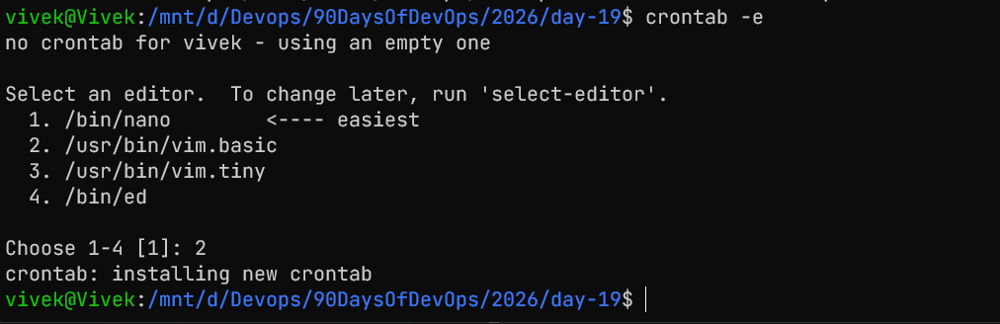

# mini-project- log-rotation-backup-crontab

## Task 1: Log Rotation Script

```Bash
#!/bin/bash


function display_usage {
	echo "Usage: ./log_rotate.sh <source dir> <backup store dir>"
}

if [ $# -ne 2 ]; then
	display_usage
	exit 1
fi

source_dir=$1
backup_dir=$2
timestamp=$(date '+%Y-%m-%d-%H-%M-%S')

function create_backup {
    zip -r "${backup_dir}/backup-${timestamp}.zip" "${source_dir}" > /dev/null 2>&1
    if [ $? -eq 0 ]; then
        echo "Backup created successfully: backup-${timestamp}.zip"
    else
        echo "Failed to create backup."
    fi

}

function rotate_logs {
    backups=($(ls -t "${backup_dir}"/backup-*.zip 2>/dev/null))
    if [ ${#backups[@]} -gt 5 ]; then
        for ((i=5; i<${#backups[@]}; i++)); do
            rm -f "${backups[i]}"
            echo "Deleted old backup: ${backups[i]}"
        done
    fi
}

create_backup
rotate_logs
```
  


## Task 2: Server Backup Script

```Bash
#!/bin/bash

function display_usage {
    echo "Usage: ./backup.sh <source dir> <backup store dir>"
}

if [ $# -ne 2 ]; then
    display_usage
    exit 1
fi

source_dir=$1
backup_dir=$2
timestamp=$(date '+%Y-%m-%d-%H-%M-%S')

function create_backup {
    zip -r "${backup_dir}/backup-${timestamp}.zip" "${source_dir}" > /dev/null 2>&1
    if [ $? -eq 0 ]; then
        echo "Backup created successfully: backup-${timestamp}.zip"
    else
        echo "Failed to create backup."
    fi
}

function rotate_backups {
    backups=($(ls -t "${backup_dir}"/backup-*.zip 2>/dev/null))
    if [ ${#backups[@]} -gt 5 ]; then
        for ((i=5; i<${#backups[@]}; i++)); do
            rm -f "${backups[i]}"
            echo "Deleted old backup: ${backups[i]}"
        done
    fi
}
create_backup
rotate_backups

```

## Task 3: Scheduling with Cron
1. backup.sh every Sunday at 2 AM
```Bash
0 2 * * 0 /path/to/backup.sh /path/to/source_dir /path/to/backup_dir
```
2. log_rotate.sh every day at 12 AM
```Bash
0 0 * * * /path/to/log_rotate.sh /path/to/source_dir /path/to/backup_dir
```
