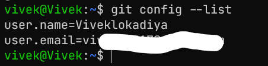
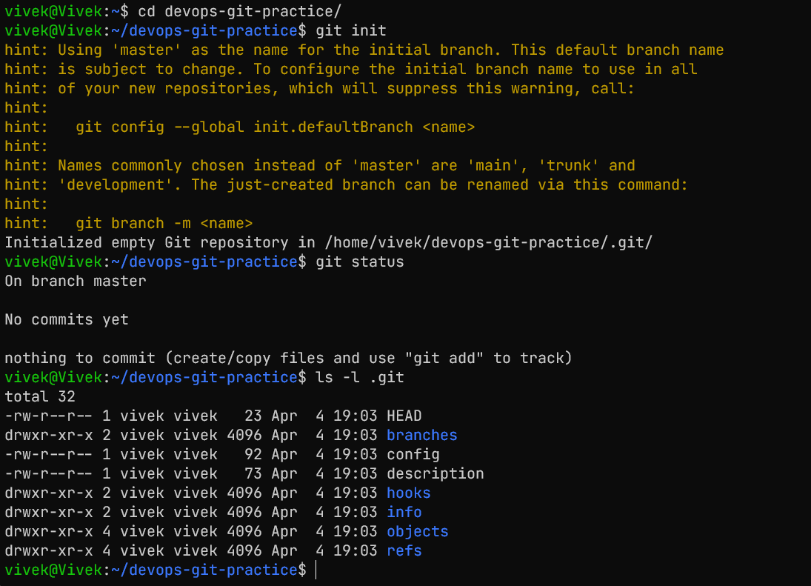
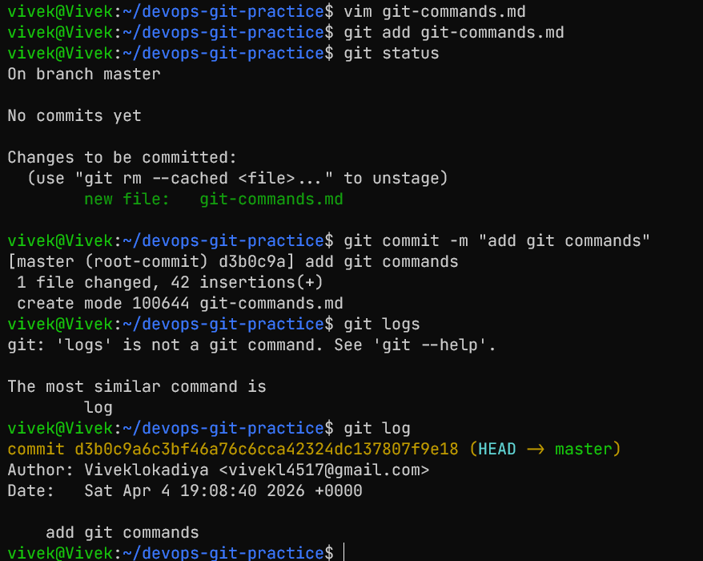
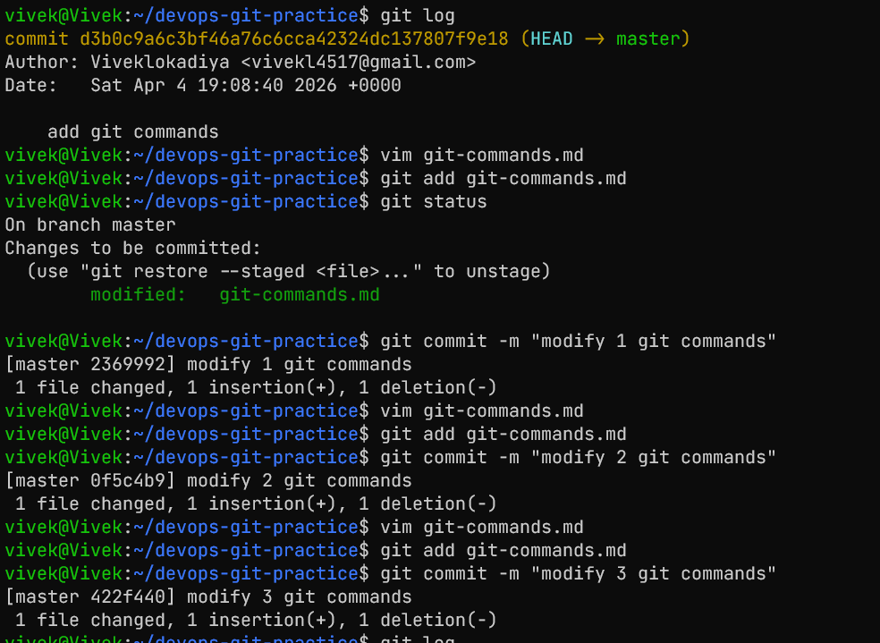
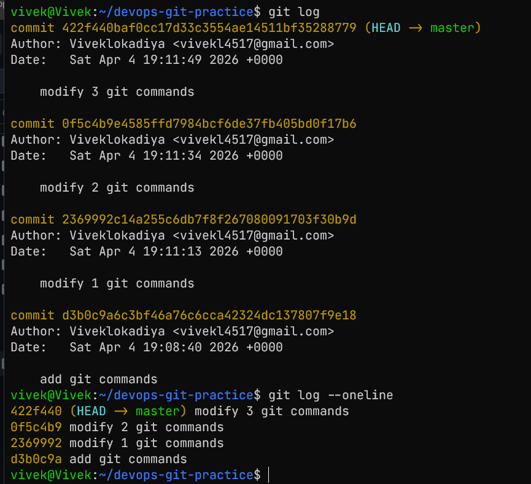

# Introduction to Git


## Task 1: Install and Configure Git
1. Verify Git is installed on your machine
2. Set up your Git identity — name and email
3. Verify your configuration

## Task 2: Create Your Git Project
1. Create a new folder called `devops-git-practice`
2. Initialize it as a Git repository
3. Check the status — read and understand what Git is telling you
4. Explore the hidden `.git/` directory — look at what's inside


## Task 3: Create Your Git Commands Reference
1. Create a file called `git-commands.md` inside the repo
2. Add the Git commands you've used so far, organized by category:
   - **Setup & Config**
    - **Basic Workflow**
    - **Viewing Changes**
3. For each command, write:
   - What it does (1 line)
    - An example of how to use it

## Setup & Config
1 check if git is installed
```bash
git --version
```
2 set up git identity
```bash
git config --global user.name "Your Name"
git config --global user.email "Your Email"
``` 
3 verify configuration
```bash
git config --list
```
## Basic Workflow
1 initialize git repository
```bash
git init
```
2 check status
```bash
git status
```
3 stage file
```bash
git add <file>
```
4 commit changes
```bash
git commit -m "Your commit message"
```
## Viewing Changes
1 view commit history
```bash
git log
```
2 view commit history in compact format
```bash
git log --oneline
```
## Task 4: Stage and Commit
1. Stage your file
2. Check what's staged
3. Commit with a meaningful message
4. View your commit history


## Task 5: Make More Changes and Build History
1. Edit `git-commands.md` — add more commands as you discover them
2. Check what changed since your last commit
3. Stage and commit again with a different, descriptive message
4. Repeat this process at least **3 times** so you have multiple commits in your history
5. View the full history in a compact format



## Task 6: Understand the Git Workflow

1. What is the difference between `git add` and `git commit`?
- `git add` adds changes to staging while `git commit` saves the staged changes to the repository with a message describing the changes.
2. What does the **staging area** do? Why doesn't Git just commit directly?
- it allows to review before commiting
3. What information does `git log` show you?
- It shows the commit history, including commit hashes, author, date, and commit messages.
4. What is the `.git/` folder and what happens if you delete it?
- it removes all git history and configuration
5. What is the difference between a **working directory**, **staging area**, and **repository**?
 - Working directory is where you make changes, staging area is where you prepare changes for commit, and repository is where all commits and history are stored.
 

