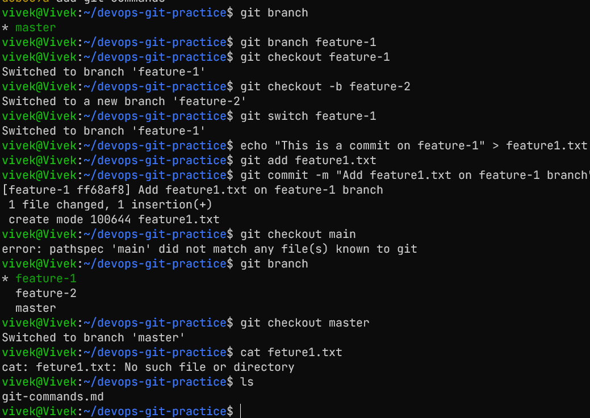
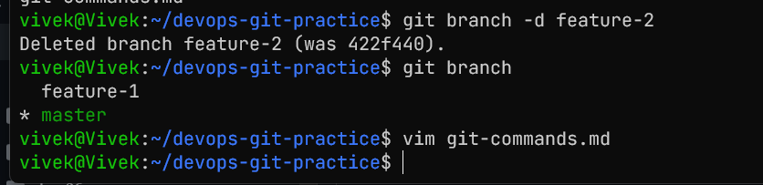
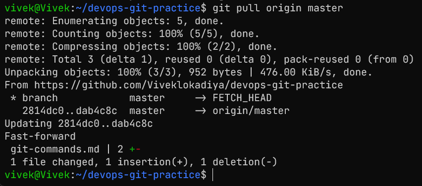

# Git Branching & Working with GitHub

## Task 1: Understanding Branches
1. What is a branch in Git?
    - A branch in Git is a lightweight movable pointer to a commit.
2. Why do we use branches instead of committing everything to `main`?
    - Branches allow us to work on different features or fixes in isolation without affecting the main codebase.
3. What is `HEAD` in Git?
    - `HEAD` is a reference to the current branch or commit that you are working on.
4. What happens to your files when you switch branches?
    - When you switch branches, Git updates the files in your working directory to match the state of the branch you switched to.

## Task 2: Branching Commands — Hands-On
1. List all branches in your repo
```bash
git branch
```
2. Create a new branch called `feature-1`
```bash
git branch feature-1
```
3. Switch to `feature-1`
```bash
git checkout feature-1
```
4. Create a new branch and switch to it in a single command — call it `feature-2`
```bash
git checkout -b feature-2
```
5. Try using `git switch` to move between branches — how is it different from `git checkout`?
```bash
git switch feature-1
```
`git switch` is a newer command that is more intuitive for switching branches, while `git checkout` can be used for both switching branches and checking out files, which can be confusing.
6. Make a commit on `feature-1` that does **not** exist on `main`
```bash
echo "This is a commit on feature-1" > feature1.txt
git add feature1.txt
git commit -m "Add feature1.txt on feature-1 branch"
```
7. Switch back to `main` — verify that the commit from `feature-1` is not there
```bash
git checkout main
cat feature1.txt 
```


8. Delete a branch you no longer need
```bash
git branch -d feature-2
```
9. Add all branching commands to your `git-commands.md`


## Task 3: Push to GitHub
1. Create a **new repository** on GitHub (do NOT initialize it with a README)
2. Connect your local `devops-git-practice` repo to the GitHub remote
```bash
git remote add origin https://github.com/Viveklokadiya/devops-git-practice.git
```
3. Push your `main` branch to GitHub
```bash
git push -u origin main
```
4. Push `feature-1` branch to GitHub
```bash
git push -u origin feature-1
```
5. Verify both branches are visible on GitHub
6. Answer in your notes: What is the difference between `origin` and `upstream`?
    - `origin` is the default name for your remote repository, while `upstream` is typically used to refer to the original repository you forked from.

## Task 4: Pull from GitHub
1. Make a change to a file **directly on GitHub** (use the GitHub editor)
2. Pull that change to your local repo
```bash
git pull origin main
```
3. Answer in your notes: What is the difference between `git fetch` and `git pull`?
    - `git fetch` retrieves updates from the remote repository but does not merge them into your local branch, while `git pull` retrieves updates and automatically merges them into your current branch.



## Task 5: Clone vs Fork
1. **Clone** any public repository from GitHub to your local machine
```bash
git clone
```
2. **Fork** the same repository on GitHub, then clone your fork
3. Answer in your notes:
   - What is the difference between clone and fork?
     - Cloning creates a local copy of a repository, while forking creates a copy of a repository on GitHub under your account.
   - When would you clone vs fork?
     - You would clone when you want to contribute to a project without needing to make changes to the original repository
     -  while you would fork when you want to make changes and potentially submit those changes back to the original repository via a pull request.
   - After forking, how do you keep your fork in sync with the original repo?
     - You can add the original repository as an upstream remote and regularly fetch and merge changes from it. 