# git advanced 


### Task 1: Git Merge — Hands-On
1. Create a new branch `feature-login` from `main`, add a couple of commits to it
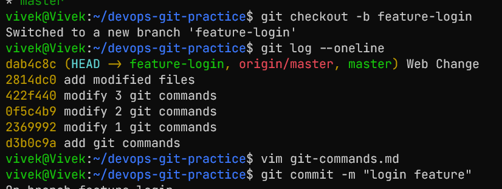
2. Switch back to `main` and merge `feature-login` into `main`
```
git checkout main
git merge feature-login
```
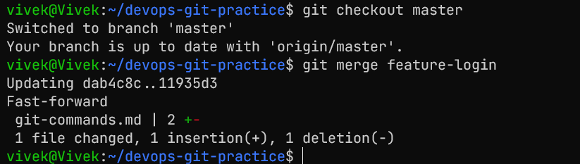
3. Observe the merge — did Git do a **fast-forward** merge or a **merge commit**?

It did a fast-forward merge 

4. Now create another branch `feature-signup`, add commits to it — but also add a commit to `main` before merging

5. Merge `feature-signup` into `main` — what happens this time?
merge conflict happens because both branches have changes to the same file

6. Answer in your notes:
   - What is a fast-forward merge?
       - it happens when the branch being merged is directly ahead of the current branch, so Git can just move the pointer forward without creating a new commit
   - When does Git create a merge commit instead?
      - when there are changes in both branches that need to be merged together
   - What is a merge conflict? (try creating one intentionally by editing the same line in both branches)
      - when we do changes in same file in both branches and git doesn't know which change to keep, it marks the file as conflicted and requires manual resolution

---

### Task 2: Git Rebase — Hands-On
1. Create a branch `feature-dashboard` from `main`, add 2-3 commits
```
git checkout -b feature-dashboard
echo "Dashboard layout" > dashboard.txt

git commit -m "Add dashboard layout"
echo "Implement dashboard widgets" >> dashboard.txt
git commit -m "Implement dashboard widgets"
```
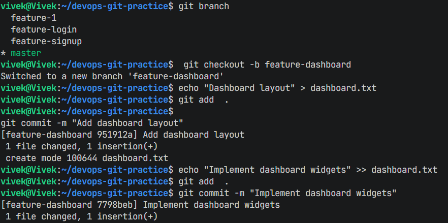
2. While on `main`, add a new commit (so `main` moves ahead)
```
git checkout master
echo "Update README" >> README.md
git commit -m "Update README with new info"
```
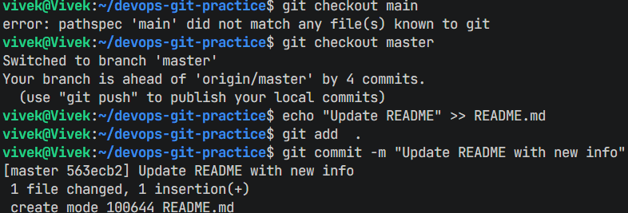
3. Switch to `feature-dashboard` and rebase it onto `main`
```
git checkout feature-dashboard
git rebase master
```
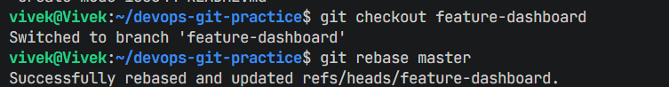

4. Observe your `git log --oneline --graph --all` — how does the history look compared to a merge?
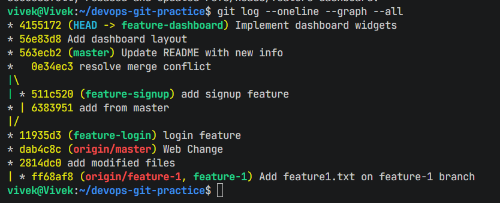
5. Answer in your notes:
   - What does rebase actually do to your commits?
      - it takes all the commits from the current branch and reapplies them on top of the target branch, effectively creating new commits with new hashes
   - How is the history different from a merge?
      - rebase creates a linear history by moving commits from the current branch on top of the target branch, while a merge creates a branching history with a merge commit
   - Why should you **never rebase commits that have been pushed and shared** with others?
      - because rebasing changes the commit history, it can cause conflicts and confusion for others who have based their work on the original commits
   - When would you use rebase vs merge?
      - use rebase for a cleaner, linear history when working on a feature branch, and use merge when you want to preserve the context of the branch and its commits

---

### Task 3: Squash Commit vs Merge Commit
1. Create a branch `feature-profile`, add 4-5 small commits (typo fix, formatting, etc.)
```
git checkout -b feature-profile
echo "Profile page layout" > profile.txt
git commit -m "Add profile page layout"
echo "Fix typo in profile page" >> profile.txt
git commit -m "Fix typo in profile page"
echo "Format profile page" >> profile.txt
git commit -m "Format profile page"
```

2. Merge it into `main` using `--squash` — what happens?
```
git checkout master
git merge --squash feature-profile

```
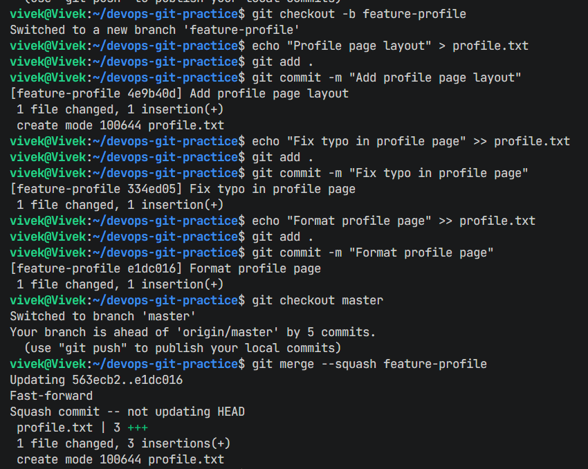
 it takes all commits form branch ang merges them in single commit
3. Check `git log` — how many commits were added to `main`?
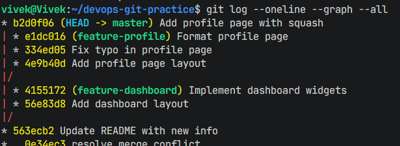
only 1 commit was added to main
4. Now create another branch `feature-settings`, add a few commits
```
git checkout -b feature-settings
echo "Settings page layout" > settings.txt
git commit -m "Add settings page layout"
echo "Implement settings functionality" >> settings.txt
git commit -m "Implement settings functionality"
```  

5. Merge it into `main` **without** `--squash` (regular merge) — compare the history
```
git checkout master
git merge feature-settings
```
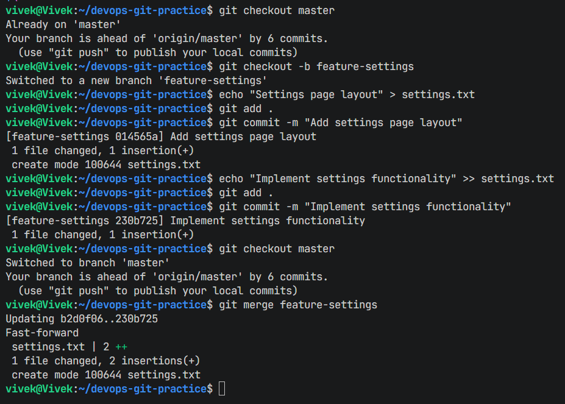
6. Answer in your notes:
   - What does squash merging do?
      - it takes all the commits from the feature branch and combines them into a single commit before merging into the target branch
   - When would you use squash merge vs regular merge?
      - use squash merge when you want to clean up the commit history by combining multiple commits into one
   - What is the trade-off of squashing?
      - while it creates a cleaner history, it can make it harder to track individual changes and understand the development process of the feature, as all commits are combined into one

---

### Task 4: Git Stash — Hands-On
1. Start making changes to a file but **do not commit**
```
echo "Work in progress" >> work.txt
```

2. Now imagine you need to urgently switch to another branch — try switching. What happens?
it will not allow us to switch branches because we have uncommitted changes that would be lost
3. Use `git stash` to save your work-in-progress
```
git add work.txt
git stash
```

4. Switch to another branch, do some work, switch back
```
git checkout feature-dashboard
echo "Some work on dashboard" >> dashboard.txt
git commit -m "Work on dashboard"
git checkout master
```

5. Apply your stashed changes using `git stash pop`
```
git stash pop
```

6. Try stashing multiple times and list all stashes
```
echo "More work in progress" >> work.txt
git add work.txt
git stash
echo "Even more work in progress" >> work.txt
git add work.txt
git stash
git stash list
```

7. Try applying a specific stash from the list
```
git stash apply stash@{1}
```
8. Answer in your notes:
   - What is the difference between `git stash pop` and `git stash apply`?
      - `git stash pop` applies the stashed changes and then removes that stash from the list, while `git stash apply` applies the stashed changes but keeps it in the stash list for potential reuse
   - When would you use stash in a real-world workflow?
      - you would use stash when you need to quickly switch contexts or branches without committing incomplete work, allowing you to save your progress and come back to it later without cluttering the commit history
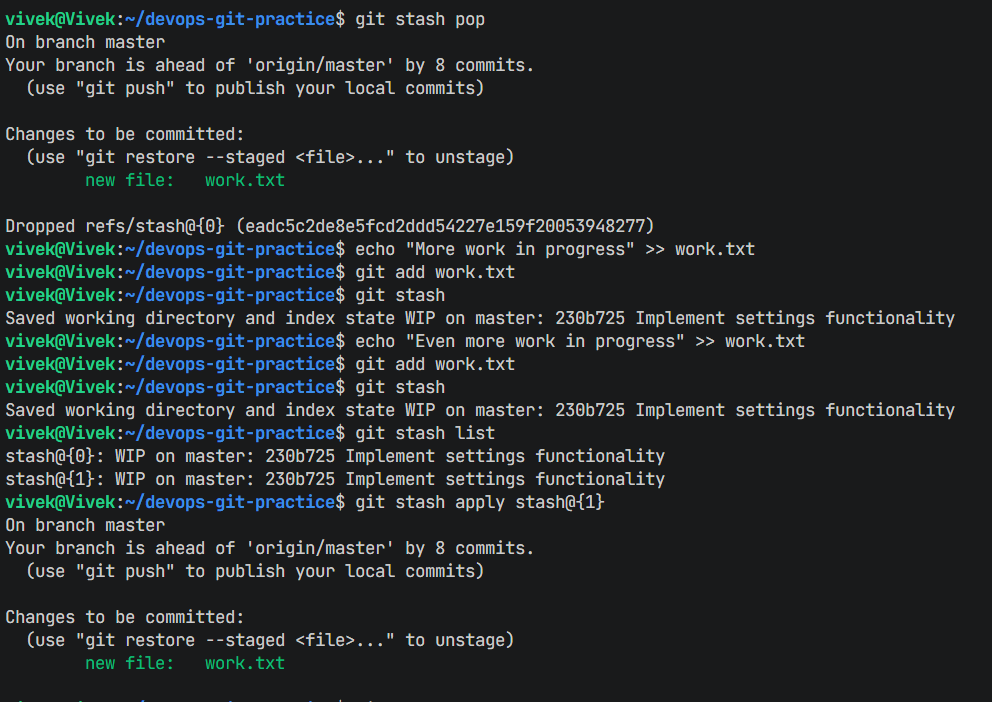

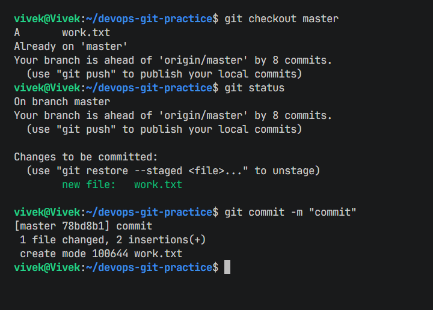
---

### Task 5: Cherry Picking
1. Create a branch `feature-hotfix`, make 3 commits with different changes
```
git checkout -b feature-hotfix
echo "Hotfix 1" > hotfix.txt
git commit -m "Add hotfix 1"
echo "Hotfix 2" >> hotfix.txt
git commit -m "Add hotfix 2"
echo "Hotfix 3" >> hotfix.txt
git commit -m "Add hotfix 3"
```

2. Switch to `main`
3. Cherry-pick **only the second commit** from `feature-hotfix` onto `main`
```
git checkout master
git cherry-pick <commit-hash-of-second-commit>
```

4. Verify with `git log` that only that one commit was applied

5. Answer in your notes:
   - What does cherry-pick do?
      - it allows you to apply a specific commit from one branch onto another branch, effectively copying that commit's changes and creating a new commit on the target branch
   - When would you use cherry-pick in a real project?
      - you would use cherry-pick when you want to apply a specific change from one branch to another, such as applying a bug fix from a feature branch to the main branch without merging the entire branch
   - What can go wrong with cherry-picking?
      - if the commit being cherry-picked has dependencies on other commits that are not included, it can lead to conflicts or broken functionality in the target branch, and it can also create a more complex history if used excessively

---